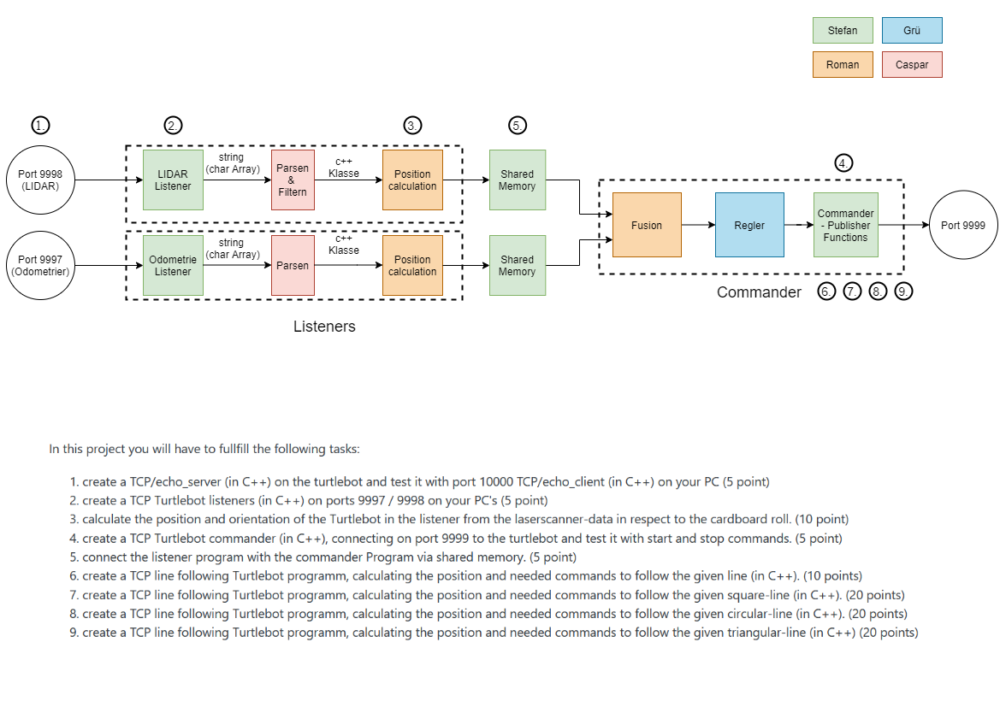

# Advanced Programming for Robotics - Project Page

## Project Structure



## Setup and Quick Start

If possible, please use the docker container. Install and setup from there on.

### Building and Running the Docker Container

The bash scripts contained in the root directory can be used to build, start and setup the docker container. Building and instantiation are done locally. The `install_image.sh` script is run automatically from inside the container during the build process.

A vim configuration will be copied onto the container and it will come preinstalled with [Neovim](https:\\\\neovim.io\\) *(the better Vim fork!)*, which can be run using `nvim`.

#### Linux

Run `build_image.sh`. This will load all the required docker images and install the system dependencies, e.g. ROS Noetic and some useful packages (since it contains [Eigen3](https:\\\\eigen.tuxfamily.org\\index.php?title=Main_Page) and [GTest](https:\\\\google.github.io\\googletest\\)).


Once the build is complete, create a persistent container from the image using `run_image.sh`. This will mount the `catkin_ws` and `packages` directories shared volumes.

**NOTE** that the container is privileged and gets access to the host network as well as read-only access to your `~\\.ssh` directory!

#### Windows

Please just use WSL instead.

Assuming you have Docker for Windows installed, open a PowerShell terminal and run

```PowerShell
docker build -t apr:latest .
``` 

inside this directory.

When the build is finished, run the container using


```PowerShell
docker run `
--name apr `
-it `
--privileged `
--network host `
-v $(Get-Location)\\catkin_ws\\src:\\catkin_ws\\src `
-v $(Get-Location)\\packages:\\packages `
apr:latest `
bash
```

I did not test this command but it might work. It is however missing the following things:

- ssh access
- X11 support (that is, no GUI here)

The container will then be listed in the docker gui and it can be started from there.

## Developer Notes

Please use your own branch, do not singlehandedly merge onto the main branch.

```
git branch <your name>
git checkout <your name>
```

Setup your own project inside the `packages` folder, develop and test it from there if possible. We will have a look at how to best combine them when time is ready.

### Compiler Settings

- `--std=c++17` or higher
- `-Wall -Wextra -pedantic` if possible

### CMake Template

Setup your project with the following basics.

```cmake
cmake_minimum_required(VERSION 3.16)
# define the project name
set(PROJECT_NAME <YOUR_PROJECT_NAME>)
project(${PROJECT_NAME})
# the program REQUIRES features that are only available from C++17 and onward
set(CMAKE_CXX_STANDARD 17)
# load dependencies and include locations for all projects
find_package (Eigen3 3.3 REQUIRED NO_MODULE)
```
If you intend on writing tests, add this directly below.

```cmake
# fech the latest Google Test Library release
# from: https://google.github.io/googletest/quickstart-cmake.html
include(FetchContent)
FetchContent_Declare(
  googletest
  URL https://github.com/google/googletest/archive/03597a01ee50ed33e9dfd640b249b4be3799d395.zip
)
FetchContent_MakeAvailable(googletest)

```

If you are writing utilities that will be used by others as libraries, add this
```cmake
# ------------- LIBRARIES AND PROGRAMS ----------------
include_directories(include)
# the library that enables to detect the position of a circle from lidar data
add_library(${PROJECT_NAME}_your_library
    src/CircleDetection.cpp
)
target_link_libraries(${PROJECT_NAME}_your_library
    Eigen3::Eigen # in case you use Eigen
    # others go here as well
)
```

Again - if you intend on writing tests, add this directly below.

```cmake
# -------------------- TESTS --------------------------
enable_testing()
add_executable(${PROJECT_NAME}_circledetection_lib_test
    src/tests/circle_detection.cpp
)
target_link_libraries(${PROJECT_NAME}_circledetection_lib_test
    GTest::gtest_main
    ${PROJECT_NAME}_circledetection_lib
)
include(GoogleTest)
gtest_discover_tests(${PROJECT_NAME}_circledetection_lib_test)

```