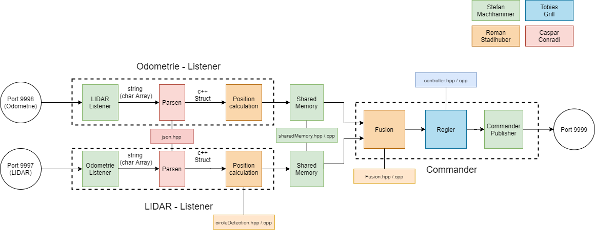

# APR Project



## Build with CMake

```bash
# create a build directory
mkdir build
# generate the build files and run the build
cmake -S . -B build/
cmake --build build/
```
Path: `cd ~/packages/listeners_commander/`

With test Simulation (Parameter `SIMULATION_ON` set to 1 in `shared_memory.hpp`):

```bash
#Commander (with correct IP-Adress of Simulation)
./build/interface_commander 192.168.0.192 <landmark-x> <landmark-y>
#Listeners(with correct IP-Adress of Simulation)
./build/interface_lidar 192.168.0.192 
./build/interface_odometry 192.168.0.192 
```
### Starting Order (Simulation)
1) Simulation
2) Commander
3) Listener Lidar
4) Listener Odometrie


Live System (Parameter SIMULATION_ON set to 0 in "shared_memory.hpp"):

```bash
#Commander (with correct IP-Adress of Simulation)
./build/interface_commander  <Server IP> <landmark-x> <landmark-y>
#Listeners(with correct IP-Adress of Simulation)
./build/interface_lidar <Server IP> [<Landmark Radius [m]>] [<Max. Scan Range [m]>]
./build/interface_odometry  <Server IP> [<Echo Port>]
```
### Starting Order (Hardware)

1) Commander
2) Listener Lidar
3) Listener Odometrie

Set Shapes:

in `TCPEchoClient_Commander.cpp` set `int Shape` variable for:

```bash
Line:       1
Triangle:   2
Square:     3
Circle:     4
```

Landmarks:
```
Line:       x = 0.5     y = 0.24
Circle:     x = 0.35    y = 0.25
Square:     x = -0.23   y = -0.19
Triangle:   x = -0.8    y = -0.48
```

#### A Note on Landmark Positions for Fusion
The landmark positions are relative to the starting robot frame. That is, when the system starts, the first odometry measurement is used as reference frame.

That is why there are separate landmark positions for the individual shapes. Landmark positions are required for pose fusion. 
Landmark positions can be observed from the lidar listener when not moving.

___________________________________________________________________________________________________________________________


## References

### Shared Memory
```
[1] Moodle-Course: Advanced Programming for Robots (MRE-VZ-1-WS2022-vAPR)
[2] Jacob Sorber: How to Set up Shared Memory in Your Linux and MacOS Programs. (shmget, shmat, shmdt, shmctl, ftok) - (https://youtu.be/WgVSq-sgHOc)
```

### Sempahores
```
[1] Moodle-Course: Advanced Programming for Robots (MRE-VZ-1-WS2022-vAPR)
[3] Jacob Sorber: What is a semaphore? How do they work? (Example in C) - (https://youtu.be/ukM_zzrIeXs)
[4] https://pages.cs.wisc.edu/~remzi/OSTEP/threads-sema.pdf
```

### TCP-IP Connection
```
[1] Moodle-Course: Advanced Programming for Robots (MRE-VZ-1-WS2022-vAPR)
```

### Json-Parser
```
https://github.com/nlohmann/json
```

### Controller
```
[5]Moodle-Course: MOR (BMR 6)
[6]https://www.arxterra.com/lecture-6-pid-controllers/
[7]https://tttapa.github.io/Pages/Arduino/Control-Theory/Motor-Fader/PID-Cpp-Implementation.html
```

